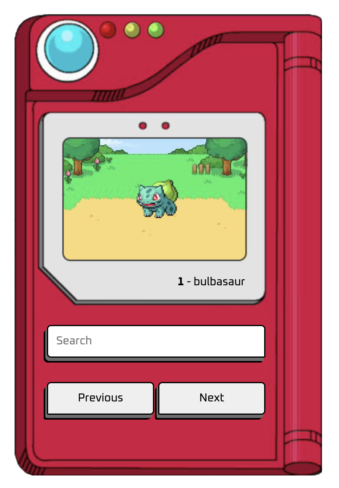

# Pokédex (Vanilla JavaScript)

A beginner-friendly Pokédex built with **HTML**, **CSS**, and **Vanilla JavaScript** using the **PokéAPI**.  
This project was created to practice JavaScript fundamentals, API consumption, and basic front-end structure.

It allows searching Pokémon by **name or ID** and displays basic information such as **ID**, **name**, and the **default sprite image**.

## Features

- Search Pokémon by **name** or **ID**
- Navigate using **Back** and **Forward** buttons
- Display Pokémon **ID**, **name**, and **sprite**
- Handle invalid searches with a _Not Found (404)_ state

## Tech Stack

- HTML5
- CSS3
- JavaScript (ES6+)
- PokéAPI

## How to run the project

```bash
# Clone the repository
git clone https://github.com/Richard-coding/pokedex-javascript

# Open index.html in your browser
```

## Preview

<p align="center">  </p>
